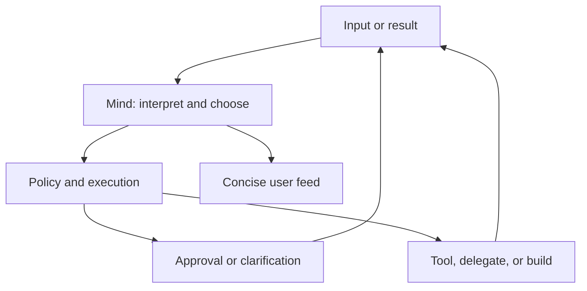

# Relay

Relay is a **local-first Windows desktop orchestrator** for ideas, notes, projects, and approved agent work. Its central capability is turning conversational context into useful tasks without requiring you to formulate every task yourself.

**RELAY0** is the local model that interprets context, judges what matters, chooses actions, and observes their results. Ministral 8B is the current reference model; the orchestration model should remain independent of the model serving it. Deterministic software enforces permissions, executes operations, and records what actually happened.

## Current implementation

The project is partway through the [orchestrator rebuild](docs/09-orchestrator-rebuild.md). The intended experience below describes the target; the current desktop still exposes parts of the earlier architecture.

| Area | Current state |
| --- | --- |
| Mind loop | Implemented under `orchestrator.mode = "mind"`. Direct classification, the stream judge, and the global capture state machine still need consolidation. |
| Delegation | Streaming replies, concise digests, and up to three turns under one approval are implemented. Contextual prompt construction and autonomous follow-ups still need improvement. |
| Tool building | JavaScript draft → test → approve promotion → use → revert is implemented. Tools can compute; their host functions currently provide only the clock and time zones. |
| Interface | Native WinUI shell with separate capture, Ask, Response, Attention, and Review surfaces. One feed and one composer are planned. |
| Evidence | Deterministic tests and selected live model cases exist. The current UI smoke test uses the legacy grammar and heuristic judge. |

Two remaining gaps matter: observed and dialogue tasks cannot currently propose external requests or preference/prompt changes; and the search permission flag adds instructions to a delegate prompt without implementing search execution.

## One mind, one loop

Every input should enter the same orchestration engine as an **observation**: a typed ask, a stretch of enabled conversation, a tool result, a policy decision, an approval, a denial, a streamed fragment from another AI, or your reply. Each task retains its own progress and waits, so one pending approval does not stop listening or unrelated work.

Each mind step returns a schema-constrained move — `say`, `use_tool`, `propose`, `delegate`, `build`, `ask_user`, `wait`, `stop` — plus a brief interpretation and one sentence for the feed.



Tasks originate from `direct` requests, `observed` conversation, or `dialogue` with Relay. Origin affects authorization, urgency, and presentation; the same capabilities should be available to propose. **Improvement is a task kind that can arise from any origin.**

Local first: Relay retrieves relevant context and evaluates what its knowledge and tools can resolve. It offers delegation or a new capability when needed. After each action, it reads the result, updates its understanding, and chooses the next move until the objective is satisfied, cancelled, or visibly blocked.

## Intended experience

- **Listen.** Process enabled conversation streams and explicitly connected sources. Read enough surrounding text to recognize useful notes, questions, connections, and inconsistencies. Direct interaction remains available while listening continues; broader desktop monitoring is outside this scope.
- **Ask.** Use one typing-first composer. Wispr Flow or another transcription provider supplies text through that interface. Direct questions receive concise answers; observed conversation produces a useful finding or no interruption.
- **File and transform.** Name the note type and project, preserve source references, and propose changes when authorization or clarification is needed. Support moves, merges, archives, and explicitly authorized deletion.
- **Delegate.** Retrieve relevant local decisions and identify missing information, then write a task-specific prompt with the approved context. Observe the streaming reply, ask useful follow-ups within the approved scope, and show concise findings and recommended actions. Retain the full response behind the summary.
- **Build a tool.** Recognize a missing capability, specify a reusable contract, draft and test it, and request one approval at promotion. Observe failures and offer retry or delegation. Install the approved tool, use it to complete the original request, and make it available for later work.
- **Improve.** Recognize repeated work and user corrections. Propose changes to preferences, prompts, tools, or reusable workflows; evaluate approved changes and keep them reversible.

One feed manages attention: routine work gets a subtle indication; useful findings remain available; proposals have inline decisions. Source excerpts, tool calls, results, timing, tokens, and diagnostic details are expandable. Feed text describes observable actions and concise decision summaries.

## Privacy and authority

- Automatic work reads only approved sources. Project mutations and external disclosure are governed by policy, explicit approval, and applicable standing grants.
- Conversation text is temporarily buffered and checkpointed in staging. The current default (`stream.bufferSeconds = 0`) holds the whole session until it stops; selected source excerpts are retained separately under a density guard. The temporary buffer is cleared on normal stream completion.
- The ledger is append-only and hash-chained. Overheard prose is fingerprinted; direct requests and non-overheard task diagnostics can include text. API keys are held separately in DPAPI.
- Approval binds to the proposal hash. Execution consumes a single-use, time-limited capability and re-checks policy against the current world.
- Workers run in a job object with brokered access. Generated JavaScript has no direct file, network, or process access.
- Preferences and approved prompt changes are recorded as revertible change sets.

## Requirements

- Windows 11 (x64), [.NET SDK 10.0](https://dotnet.microsoft.com/download/dotnet/10.0). Unpackaged WinUI 3, self-contained Windows App SDK. No Visual Studio required.
- **RELAY0:** any OpenAI-compatible chat endpoint. The reference is [llama.cpp](https://github.com/ggml-org/llama.cpp) or Ollama serving **Ministral 8B Instruct (Q4_K_M)** on loopback. The context window must be at least **8k tokens** (the mind's prompt plus a task's transcript runs to 2–5k). Set the server context explicitly: the reference evaluation encountered instruction loss with a 2048-token window. `tools\live-eval.ps1` derives a model with `num_ctx` for its runs; for Relay itself:

```powershell
# llama.cpp
llama-server -m Ministral-8B-Instruct-2410-Q4_K_M.gguf -c 16384 --port 8080 --jinja

# Ollama (once): FROM <model> / PARAMETER num_ctx 8192 in a Modelfile
ollama create relay-ministral -f Modelfile
```

The current default is `rules+model`. Select `mind` and enable a model to exercise the rebuilt loop. Legacy grammar and heuristic paths remain available during migration; they do not demonstrate model-led orchestration.

## Build, test, run

```powershell
dotnet build Relay.slnx
dotnet test tests/Relay.Tests/Relay.Tests.csproj
dotnet run --project src/Relay.Desktop/Relay.Desktop.csproj
```

`Relay.exe` is under `src\Relay.Desktop\bin\Debug\net10.0-windows10.0.26100.0\` (`bin\x64\Debug\…` when launched through `dotnet run`) with `Relay.Worker.dll` beside it. One instance per data root; a second launch brings the first forward. Override the data root with `RELAY_DATA_ROOT`.

```powershell
powershell -NoProfile -ExecutionPolicy Bypass -File tools\ui-smoke.ps1
powershell -NoProfile -ExecutionPolicy Bypass -File tools\live-eval.ps1   # needs RELAY_LIVE_MODEL_KEY (any value on loopback)
```

`dotnet test` normally exercises the real coordinator, stores, policy, executor, and loop against a fixed clock, a manual scheduler, and scripted minds. Failures print the session transcript. Live tests return immediately unless `RELAY_LIVE_MODEL_KEY` is set; a green default run does not mean those checks ran.

`ui-smoke.ps1` exercises the current desktop through the legacy grammar and heuristic judge. Product acceptance must additionally use the real model through the desktop, with actual tool results, screenshots, timing, token usage, and an outcome checked against the original objective.

## Using the current build

1. **Point RELAY0 at a model** — *Settings → Model*: enable the model and set a loopback chat-completions URL and model name; no key is needed for loopback. Set orchestrator mode to **mind**. Conversation observation still uses the separate `judge.mode`; select `model` to evaluate that path.
2. **Create a project** — *New project…*, or type `create project Atlas` and approve.
3. **Listen** — Ctrl+Alt in the Relay window. Type or dictate into the capture surface; Ctrl+Alt again stops. Check the displayed judge to see which implementation is processing the stream.
4. **Ask** — use the **Ask Relay** box and press Enter: `what did we decide about the Atlas beta date?` Ctrl+X currently toggles command capture; the unified composer is pending.
5. **Delegate** — configure an external profile and its key, then ask for work. Review the outgoing package before approving, or choose **Retry locally**. The sample `research` profile below is a chat endpoint; it does not by itself provide online search.
6. **Shape Relay** — `always show what CAD means`, `file Atlas decisions without asking`, `keep responses concise`. Each is a reversible change set. `What time is it in Tokyo?` is how it grows a tool.

## Settings

`%LOCALAPPDATA%\Relay\config\settings.json` (also *Settings* in the window):

```json
{
  "schemaVersion": 2,
  "hotkeys": { "scope": "window", "noteKey": "Ctrl+Alt", "commandKey": "Ctrl+X" },
  "stream": { "bufferSeconds": 0, "observeIntervalMs": 12000, "minIngestChars": 240, "minIngestSeconds": 20, "excerptMaxSeconds": 30, "maxRetainedFraction": 0.25 },
  "orchestrator": { "mode": "mind", "maxSteps": 12, "planningTimeoutMs": 60000, "maxToolCalls": 8 },
  "judge": { "mode": "model" },
  "model": { "enabled": true, "endpoint": "http://127.0.0.1:8080/v1/chat/completions", "model": "ministral-8b-instruct", "secretName": "model-gateway", "timeoutMs": 30000, "maxOutputTokens": 800 },
  "externalModels": [ { "name": "research", "endpoint": "https://api.openai.com/v1/chat/completions", "model": "gpt-5-nano", "secretName": "external-research", "maxOutputTokens": 4000 } ],
  "workers": { "enabled": true, "wallClockSeconds": 120, "memoryMb": 512 }
}
```

`orchestrator.mode`: `mind` selects the rebuilt task loop; `rules+model` is the current default and runs the older grammar before the model. Even in mind mode, direct classification and stream observation still use separate paths. Preferences live in `config\preferences.json` and change only through approved change sets. `stream.bufferSeconds` 0 holds the whole conversation for the session; 15–600 restores a rolling window.

## What is on disk

```
%LOCALAPPDATA%\Relay\
  ledger\relay-ledger.jsonl        hash-chained events; direct requests may contain text
  registry\projects.json           identities, slugs, aliases, roots, per-project policy
  config\settings.json             settings
  config\preferences.json          typed preferences (change sets only)
  config\secrets\*.bin             DPAPI-protected API keys
  config\prompts\*.md              mind / build / digest fragments (change sets only)
  config\decisions.json            route, filing, risk weights (change sets only)
  changesets\{id}.json             every self-change with its before image
  tools\{name}.json                promoted tools (manifest + source + tests)
  staging\tools\                   drafts under test
  staging\stream\                  temporary conversation checkpoint
  excerpts\{id}.json               bounded, trigger-anchored conversation excerpts
  tasks\{id}.json                  per-task diagnostics
  artifacts\external\              approved external replies (source artifacts)
  archive\  backups\  sessions\  incidents\

<project folder>\<slug>\
  project.toml  notes\ decisions\ tasks\ artifacts\
  .orchestrator\versions\          previous versions of every file Relay rewrote
```

## Repository

```
src/Relay.Core       ledger, mind, loop, policy, executor, tools, decisions, storage
src/Relay.Gateway    OpenAI-compatible HTTP client (loopback http or https)
src/Relay.Windows    chords, single instance, DPAPI, job-object worker host
src/Relay.Worker     sandboxed worker; Jint for built tools
src/Relay.Desktop    WinUI 3 window
tests/Relay.Tests    xUnit: scenario DSL, scripted mind, evaluation cases
docs/                specifications (09 is the current intent)
```

## Next development priorities

Run model-backed acceptance throughout these changes. Keep the ledger, path guards, stores, executor, worker broker, gateway, and change sets as the foundation.

1. **Centralize interpretation.** Make the mind the primary path for direct, observed, and dialogue work; remove the intent grammar and separate capture state from task progress.
2. **Correct proposal authority.** Let any task origin propose useful work, with execution controlled by the applicable approval or grant.
3. **Complete the feed.** One composer, concise progress and findings, inline approvals, task-linked replies, and expandable evidence.
4. **Connect context and research.** Improve source retrieval, implement approved search execution, and make delegation carry the current knowledge state and useful follow-ups.
5. **Generalize improvement.** Discover and reuse tools, support more brokered capabilities, and evaluate reversible preference and workflow changes from user feedback.

The first combined desktop acceptance should demonstrate a missing clock tool being built and reused, a fact check triggered both directly and conversationally, and a contextual external task with actual research evidence. Include unfamiliar phrasing, failures, rejection, and cancellation; judge the result against the user's objective.

Detailed architecture and recorded evaluations: [orchestrator rebuild](docs/09-orchestrator-rebuild.md). Historical implementation plan: [earlier build plan](docs/08-build-plan.md).

