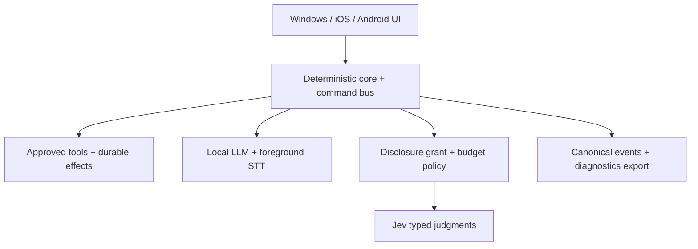

# RELAY V1 — Live Jev, Windows Acceptance, and TestFlight Final Workflow

Reviewed baseline: `1862daacc8d06c6bc367c85b4cd523779d99b8fa` (`main`, clean)

Purpose: this is the last implementation-and-verification workflow before RELAY begins internal mobile testing. It is deliberately gate-driven: Cursor Auto must not advance past a failed gate, infer evidence, or mark physical-device work complete without the recorded artifact.

## Executive verdict

RELAY is **not ready for a Jev production key or TestFlight submission yet**.

It is close enough to begin the final integration sprint. One TypeSafe/Jev API key is technically sufficient for one-person Windows and internal TestFlight dogfood, entered separately on each device. Do not paste it into Cursor/chat, commit it, place it in EAS environment variables, or bundle it in the app. Windows already has DPAPI-backed storage; iOS has SecureStore-backed storage. For a public multi-user release, use per-user keys or an authenticated server broker—never ship a shared production key in the client.

### Safe handling of the requested API-key text file

A plaintext `.txt` file is not secure long-term. Use it only as a short-lived Windows import file outside the repository, with an ACL limited to the current Windows user. Cursor must implement the native import path described below before the key is created.

Required native import behavior:

1. Add a Windows-only `Import Jev key from file` action in Settings and a matching non-interactive developer command.
2. The native/Tauri side—not browser JavaScript—opens the selected file, refuses paths inside the repository/worktree, refuses symlinks/reparse points, requires a regular file no larger than 4 KiB, trims one trailing newline, rejects an empty value or embedded line breaks, and never returns the key to JavaScript.
3. Store the value using the existing DPAPI secret store, make one redacted read-back/health confirmation, zero/replace in-memory buffers where the language/runtime permits, then delete the staging file. If deletion fails, report that plainly and do not claim secure cleanup.
4. Logs contain only `jev_key_import_started`, `jev_key_import_succeeded`, or a typed failure code plus the path classification—not the path’s username, file contents, key prefix/suffix, hash, length, command line, or environment value.
5. Add `.env*`, `*.key`, `*api-key*.txt`, `secrets/`, and the precise staging filename to repository ignore and secret-scanner rules as defense in depth. This does not make repository storage acceptable.
6. Add tests for repository-path rejection, symlink/reparse rejection, multiline/oversize/empty input, DPAPI failure, deletion failure, redaction, and successful import-and-delete.

Only after that code is green, the human creates the staging file in PowerShell:

```powershell
$relaySecretDir = Join-Path $env:LOCALAPPDATA 'RELAY\secrets'
$relaySecretFile = Join-Path $relaySecretDir 'jev-api-key.txt'
$relayIdentity = [System.Security.Principal.WindowsIdentity]::GetCurrent().Name
New-Item -ItemType Directory -Force -Path $relaySecretDir | Out-Null
icacls $relaySecretDir /inheritance:r /grant:r "${relayIdentity}:(OI)(CI)F" | Out-Null
Set-Content -LiteralPath $relaySecretFile -Value 'PASTE_THE_JEV_KEY_HERE' -NoNewline
icacls $relaySecretFile /inheritance:r /grant:r "${relayIdentity}:F" | Out-Null
```

Then use RELAY Settings to import `%LOCALAPPDATA%\RELAY\secrets\jev-api-key.txt`. Confirm the file no longer exists and Settings shows only `Configured` plus a health timestamp. Do not run `type`, `Get-Content`, shell history expansion containing the real key, or any Cursor command over the file. If the file persists, delete it through the app’s native cleanup action; do not ask Cursor to inspect it.

On iOS, do not create or transfer a text file. Paste the key into RELAY Settings, which must write directly to SecureStore and immediately clear the input state/clipboard where platform APIs permit. The key must not be included in EAS secrets, Expo config, app bundle, diagnostics, screenshots, backups, or logs.

The current blockers are implementation gaps, not merely human sign-off:

| Area | Current state at `1862daa` | Release decision |
|---|---|---|
| Deterministic core and storage | Strong; unit/integration/replay/privacy suites pass | Continue |
| Windows desktop shell | Real DPAPI, Rust HTTP, local-model and audio adapters exist | Needs live and headed proof |
| Live Jev | Transport exists, but ambient content is not disclosed to Jev; one invalid model value; policy/budget enforcement incomplete | Blocked |
| Local mobile model | Explicit `mobile_model_pending` stub | Blocked |
| Mobile speech | Explicit unavailable stub; UI can appear to listen anyway | Blocked |
| Mobile diagnostics | Browser trace sink targets a route unavailable in TestFlight | Blocked |
| Mobile product configuration | EAS project ID and submit values are placeholders | Blocked |
| Production dependency purity | `App.tsx` imports browser testkit data | Blocked |
| Headed acceptance | One deterministic journey; most journeys are lower-layer tests | Blocked |
| Exact-tip CI/release evidence | No verified green exact-tip run for this SHA | Blocked |

## Review evidence

Local verification performed at the reviewed SHA:

- `npm ci`: passed.
- `EXPO_PUBLIC_GIT_SHA=1862... GIT_COMMIT=1862... CI=true npm run verify:v1`: JavaScript/TypeScript checks passed through Expo web and iOS exports, including 110 unit, 18 architecture, 69 integration, two replay, and five privacy tests. The run stopped at Rust formatting because this review environment has no `cargo`; this is an environment limitation, not a green full gate.
- `npm run test:e2e:golden`: passed 28 tests, but those tests are lower-layer and are not headed product proof.
- `node --import tsx tools/manual/msrp-preflight.ts`: passed structural preflight; it is not a Windows UI run.
- A Windows installer, Windows headed UI, physical iPhone, physical Android device, live Jev call, live local model, and live microphone were not runnable in this Linux review environment.

The implementation ledger is currently optimistic where it says the remaining stops are human-only. They are not. Keep F2/F3/F4/F5/F6/F7/F8 non-green until the code and device gates below are complete.

## Non-negotiable product boundaries

1. Code owns permissions, workflow, persistence, tool execution, disclosure rules, retries, and budgets.
2. Jev provides narrow typed semantic judgments with bounded questions. It never executes tools or silently grants authority.
3. The local model drafts, summarizes, extracts candidates, and repairs typed output. It never approves actions or masquerades as Jev.
4. No random, heuristic, recorded, or local-model answer may silently replace an unavailable Jev judgment. A required semantic judgment becomes visibly waiting/blocked and can resume once.
5. Raw source material marked local-only, and any derivative that can reveal it, must not be sent to Jev.
6. Hosted processing is authorized by a scoped, expiring project/session grant with an explicit request/token budget. A global Boolean is not sufficient.
7. Consumer UI uses plain language. Canonical error codes and protocol detail remain in the developer console and exported diagnostics.
8. Production bundles contain no browser testkit, recorded provider, demo provider, fixtures, or deterministic fake data.
9. No gate is green from prose. Every gate has a command, artifact, device record, or exact UI observation.

## Target architecture



Only `Policy` may construct the provider-safe state sent to Jev. The developer console reads the same canonical events that tests and exports read; it must not maintain a second, prettier truth.

## Ordered release gates

Cursor Auto must execute these gates in order. After every green gate: update `docs/implementation/FINALIZATION_STATUS.md`, add exact evidence, commit one coherent change, push it, and verify `git status --short` is empty. Do not rewrite or delete prior evidence.

### G0 — Freeze the truth and remove false readiness

Actions:

1. Create `docs/implementation/RELAY_LIVE_JEV_TESTFLIGHT_FINAL_WORKFLOW_1862daa.md` from this document.
2. Reconcile `docs/STATUS.md`, `docs/implementation/FINALIZATION_STATUS.md`, the capability matrix, and Windows acceptance docs to the reviewed SHA.
3. Replace “remaining stops are human-only” with the real code/device blockers in this workflow.
4. Label every capability as `shipped`, `degraded`, `not-shipped`, or `unverified-on-device`; never use ambiguous “complete.”
5. Record exact toolchain versions and the SHA in every later evidence file.

Exit gate:

- Status documents agree.
- F2–F8 remain non-green until their actual exits are met.
- CI starts from a clean exact SHA.

### G1 — Make live Jev correct, scoped, and observable

Protocol changes:

1. Centralize the provider model in one configuration constant and default it to `jev-latest`. Remove `model: "typesafe"` from ambient triage and remove scattered `jev-1.13.0` literals unless an explicit, documented pin is required.
2. Send only the documented API request fields: `state`, `model`, and `questions`. Keep RELAY question-set IDs/versions in local canonical events, not undocumented top-level provider JSON.
3. Validate every response:
   - output key matches a submitted question;
   - kind matches `Noul`, `Choice`, or `Score`;
   - Choice selection belongs to the supplied options;
   - Choice probabilities are finite, within `[0,1]`, and sum within tolerance;
   - Score value belongs to the supplied legend;
   - Noul probability and confidence/range fields follow the current documented schema;
   - unknown/missing/duplicate outputs fail closed.
4. Add exponential backoff with bounded jitter for `429` and `529`, honor `Retry-After`, and keep timeouts/cancellation abortable. Do not retry validation errors or authorization failures.
5. Capture the provider request ID when present. Never require it if the provider omits it.

Disclosure and budget changes:

6. Replace the global hosted-processing Boolean as the authorization decision with a durable disclosure grant:
   - project/session scope;
   - created/expiry timestamps;
   - allowed source classes;
   - disallowed local-only sources and revealing derivatives;
   - maximum provider requests and token/byte budget;
   - revocation state;
   - grant ID on every attempt.
7. Add one disclosure-envelope builder. It loads allowed source objects, produces the minimum necessary provider state, records source hashes/byte counts/transformation IDs, and refuses anything outside the grant.
8. Fix ambient triage so Jev receives the authorized transcript/excerpt it is judging. Today the request only sends `{ origin: "observed" }`, so Jev cannot judge importance, commitment, correction, or open questions.
9. Give acronym resolution the minimum authorized conversational context, not only a token/options list.
10. Enforce at most two semantic-resolution rounds per originating action. Persist round count and terminal reason.
11. On missing key, offline network, rate limit exhaustion, provider error, or revoked/expired budget, create one durable waiting item. Re-enabling the valid grant resumes it once; it must not duplicate the downstream effect.

Developer evidence per judgment:

- correlation/run ID and originating action;
- provider/model and whether a provider call occurred;
- question-set ID/version and each typed question;
- allowed options/legend;
- selected result, probabilities, and confidence where the provider supplies it;
- grant ID/scope/expiry and budget before/after;
- disclosed source hashes/classes/byte counts—never raw secrets in ordinary logs;
- attempt number, latency, HTTP class, retry delay, cancellation/timeout;
- provider request ID when present;
- cached/waiting/resumed/terminal outcome.

Automated tests:

- contract fixtures for every valid response kind;
- malformed/missing/extra/wrong-kind outputs;
- invalid Choice option and bad probability sum;
- `401`, `402`, `422`, `429`, `529`, timeout, cancellation, network loss;
- `Retry-After` and exponential backoff with fake time;
- no retry on `401/402/422`;
- expired/revoked/exhausted/wrong-project grant;
- local-only source and revealing derivative rejected before network I/O;
- ambient request contains authorized content and excludes unauthorized neighboring content;
- no key or authorization value appears in logs/exports/snapshots;
- unavailable → one durable wait → resume exactly once;
- second semantic round allowed; third refused.

Live canary, only after all automated tests pass:

- The human imports one Jev key using the restricted, short-lived Windows staging file above. Cursor never receives or reads it.
- Run one tiny Noul, one bounded Choice, and one Score through the real transport.
- Confirm one provider call each, valid typed responses, redacted export, visible latency/request ID if supplied, and no downstream tool execution without separate approval.
- Remove the live canary artifacts or mark them private; never commit credentials or raw sensitive text.

Exit gate:

- Live canary passes with one key.
- All protocol, privacy, retry, waiting/resume, and budget tests pass.
- Jev is useful because it receives authorized context, while unauthorized context provably never reaches the transport.

### G2 — Correct core behavior and product semantics

Actions:

1. Remove the unconditional `@relay/testkit/browser` import from `apps/relay/src/App.tsx`. Put fixture replay behind a desktop/dev-only dynamic boundary or the headed test harness.
2. Add a production dependency-graph assertion over web, iOS/Metro, Android, and desktop bundles. Fail if any contains `@relay/testkit`, recorded judgments, fixtures, or demo providers.
3. Normalize reviewed reflex output:
   - “add a note” persists a note only after explicit user intent or review;
   - “remember a fact” persists a typed accepted fact, not a generic note;
   - “what should I do next?” creates a recommendation/action candidate, not a generic note;
   - ambient observation creates a reviewable recommendation, never a silent commitment.
4. Reconcile each reflex definition’s `approvalMode` with behavior. Explicit commands may be approved by the utterance; inferred actions require review.
5. Replace debug strings such as `note:...`, `fact:...`, and `next:...` with polished product copy while retaining typed internal records.
6. Confirm cancellation prevents post-cancel mutation and that replay/idempotency prevents duplicate effects.

Exit gate:

- Production bundles are fixture-free.
- Note/fact/recommendation/action have distinct stored semantics.
- All tool effects are traceable to explicit intent or a recorded approval.
- Unit, architecture, integration, replay, and privacy suites pass.

### G3 — Ship a bounded on-device model, speech, and mobile diagnostics

Use one native runtime through an Expo custom native client. The recommended bounded candidate is React Native ExecuTorch because it provides actual iOS/Android native inference and supports small LLM and Whisper families. Do not pretend Expo Go is the target runtime.

Local model tournament:

- Quantized LFM2.5 350M.
- Quantized SmolLM2 360M.
- A current supported ~0.5B alternative such as Hammer 0.5B, if its runtime package and license are acceptable.

Tasks to benchmark on an iPhone 15 Pro Max and Galaxy S23 Ultra:

- two-sentence direct chat;
- typed candidate extraction;
- local query formulation;
- short summarization;
- invalid typed output followed by one repair;
- cancellation during prefill and generation;
- airplane-mode start and completion.

Hard limits:

- model download no more than 1.2 GB, with a target under 600 MB;
- peak app memory no more than 2.8 GB and steady state no more than 2.2 GB;
- 2,048-token context and 256-token maximum output unless measured evidence justifies less;
- cold first-token p95 no more than 4 seconds;
- warm first-token p95 no more than 2 seconds;
- median decode at least 12 tokens/second;
- at least 98% valid typed output after one repair on the release corpus;
- cancel acknowledgment no more than 250 ms;
- 15-minute mixed workload with no crash, thermal termination, or unrecovered memory climb.

Model delivery:

1. Download on demand, not in the IPA.
2. Show size, Wi-Fi recommendation, progress, pause/cancel, version, license, SHA-256 verification, and delete/re-download.
3. Pin a tested model/runtime pair in the release manifest.
4. If no candidate meets the gate on both target phones, reduce local scope honestly; do not substitute a cloud model without a new disclosure decision.

Speech:

5. Implement foreground-only STT using a small supported Whisper Tiny package in the same native runtime where practical.
6. Wire the Listen command through the speech port. If microphone/model permission or capability is unavailable, listening must remain false and the UI must say why.
7. Show actual audio level only when measured; remove the fake waveform.
8. Handle permission denied, interruption, route change, backgrounding, cancellation, and relaunch.

Mobile storage and diagnostics:

9. Verify `crypto.subtle`, base64 conversion, AES-GCM create/relaunch/decrypt/delete, and key-loss behavior on Hermes on both physical platforms.
10. Replace the browser `/__relay/trace` sink on native with a mobile-native bounded log store.
11. Add Share/Export Diagnostics: manifest, canonical events, decisions, queue/dead letters, capability matrix, versions, redacted settings, and selected run/case. Never include API keys or unrestricted raw transcripts.
12. Make “Open run folder” desktop-only; mobile uses Share/Export.
13. Make Jev health evidence-based by wrapping actual judgment calls and recording success/failure, not merely key presence.
14. Remove or implement the unused `native_system_one_pending_dev_client` path so the capability matrix is truthful.

Exit gate:

- iPhone 15 Pro Max and Galaxy S23 Ultra evidence for model, speech, encrypted relaunch, background/foreground, export, and 15-minute soak.
- Mobile has no explicit pending/unavailable stub for a V1-required capability.
- Airplane mode preserves all local functions and visibly waits any required Jev judgment.

### G4 — Finish consumer UI and the truthful developer console

Shared UI requirements:

1. Add explicit `initializing`, `ready`, `busy`, `waiting`, `degraded`, `failed`, and `retrying` surfaces. Do not render an unexplained blank snapshot during boot.
2. Preserve input and scroll position across rotation/resizing, keyboard appearance, background/foreground, and provider failure.
3. Map internal codes to concise human messages. Put raw codes/stacks/request metadata in diagnostics.
4. Distinguish core health from optional provider health. Halo or Jev being unavailable must not mark the entire local app red.
5. Eliminate layout shift and double submission. Keep Stop responsive during model/provider work.
6. Keep all interactive targets at least 44×44 points, honor safe areas and dynamic type, label controls, expose focus/selected/busy states, and verify keyboard-only Windows use.

Windows-specific:

7. Preserve the focused phone-sized product pane and the right-side developer console on wide screens; use drawer/tabs on narrower layouts.
8. Hide developer UI by product flavor/channel, not only `EXPO_PUBLIC_RELAY_DEV_CONSOLE`. It must be impossible to expose accidentally in App Store production.
9. Keep Current Case, Decisions, and Run Events derived from canonical events.
10. Add filters by run/case/provider/severity, copy IDs, export selection, and live-follow/pause without dropping events.

Mobile-specific:

11. Do not show Windows `127.0.0.1:8080` setup copy on iOS/Android. Show the installed local model, download state, storage, and device benchmark status.
12. Keep developer UI unavailable in App Store production and available only in signed internal testing channels.
13. Use Share Diagnostics instead of desktop filesystem affordances.

Visual quality gate:

- Capture approved screenshots at Windows 1280×720, 1440×900, 1920×1080; iPhone 15 Pro Max portrait/landscape; Galaxy S23 Ultra portrait/landscape; light/dark; 100% and enlarged text.
- Add screenshot-diff thresholds for stable core surfaces and accessibility automation where supported.
- No clipped text, hidden primary action, horizontal overflow, unreadable contrast, fake activity, or debug copy in consumer surfaces.

Exit gate:

- Visual, responsive, keyboard, screen-reader-label, reduced-motion, and error-state checks pass.
- Developer console and exported bundle tell the same story for the same run.

### G5 — Complete automated production coverage

Required CI lanes at one exact SHA:

1. Format, lint, typecheck.
2. Unit and architecture.
3. Integration, replay, privacy, and migration/rollback.
4. Jev protocol/disclosure/budget/wait-resume contract suite.
5. Local-model typed-output corpus using the pinned device/runtime build plus a deterministic lower-layer test double.
6. Speech state-machine tests and recorded-audio transcription corpus.
7. Production dependency/bundle purity.
8. Expo web/iOS/Android export and custom-dev-client build.
9. Rust fmt, clippy with warnings denied, unit/integration tests.
10. Desktop smoke and Windows NSIS build/install/uninstall.
11. Headed Windows golden journeys.
12. Secret scanning and diagnostics-redaction tests.

Rules:

- Recorded providers are allowed only in explicit deterministic test lanes.
- A mocked provider test cannot satisfy a live-provider gate.
- An export cannot satisfy a physical-device gate.
- A lower-layer Playwright/core test cannot satisfy a headed product journey.
- Flaky retries do not make a gate green; record and fix the cause.

Exit gate:

- All lanes pass at one pushed SHA.
- The status ledger links that exact run and SHA.
- The tree is clean and the release commit is signed/tagged according to repository policy.

### G6 — Implement and pass the full headed Windows journey suite

Each journey must start from a named isolated profile, drive visible product controls through Playwright/WebDriver-compatible selectors, assert durable state and canonical events, export diagnostics, and save screenshot/video/trace. Lower-layer calls do not count.

| # | Headed journey | Required proof |
|---|---|---|
| 01 | App boot and local chat | Initializing→ready; one local answer; no Jev call |
| 02 | Add a note | Explicit command; one note; persisted after relaunch |
| 03 | Remember a fact | One typed fact; distinct from note; persisted |
| 04 | Next-task recommendation | Reviewable recommendation; accept/reject paths |
| 05 | Ambient important-item detection | Authorized transcript reaches Jev; review card appears |
| 06 | Acronym ambiguity | Bounded Choice with context; probabilities visible; no tool execution |
| 07 | Jev unavailable/resume | One waiting item; no fake answer; resumes exactly once |
| 08 | Disclosure/budget refusal | Network not called; precise local denial evidence |
| 09 | Foreground speech | Real mic or controlled audio input; transcript→candidate→review |
| 10 | Stop/cancel | Immediate UI response; no later mutation |
| 11 | Crash/relaunch/replay | Durable recovery; no duplicate side effect |
| 12 | Diagnostics while running | Export/current case/case explanation match live console |

Add a 30-minute Windows mixed-workload soak with local chat, live Jev, speech, accept/reject, resizing, backgrounding, diagnostics export, and relaunch. Assert bounded log/queue growth and no resource leak severe enough to affect interaction.

Exit gate:

- All 12 journeys pass at the exact release SHA on Windows.
- The NSIS installer installs on a clean Windows user profile, launches, updates or reinstalls safely, and uninstalls without deleting user data unless explicitly chosen.

### G7 — Human Windows release rehearsal (the final pre-mobile test)

This is the test the product owner runs. It authorizes an internal TestFlight release candidate; it does not replace iPhone device acceptance.

Preparation by Cursor/AI:

1. Produce the signed/identified Windows release-candidate installer and SHA-256.
2. Produce one command that starts the local model with the pinned model and one command that verifies health.
3. Create an isolated release-candidate profile and diagnostics destination.
4. Run automated preflight and show exact SHA, suite results, bundle-purity result, and capability matrix.
5. Stop before requesting credentials.

Actions by the human:

1. Install and launch the Windows RC.
2. Start the local model using the supplied command.
3. Create the restricted staging file using the supplied PowerShell commands, import it through RELAY Settings, and confirm it was deleted. Do not give the key to Cursor.
4. Keep hosted processing off initially.

Manual script and expected result:

1. **Local-only chat:** enter: `In two sentences, help me plan the next RELAY test.`
   - Expected: streamed local response; Stop works; Decisions says provider not called; core health remains green.
2. **Explicit note:** enter: `Add a note that the Windows release rehearsal started successfully.`
   - Expected: exactly one note, visible in history and after relaunch.
3. **Hosted grant:** enable hosted processing for only this session/project, allow conversation excerpts, set a small visible request budget, and confirm the disclosure preview.
4. **Acronym Choice:** enter: `In this pharmaceutical discussion, API stands for Active Pharmaceutical Ingredient. What does API mean here?`
   - Expected: a bounded Jev Choice selects `Active Pharmaceutical Ingredient`; the developer console shows model, questions, options/probabilities, grant/budget, disclosed hashes/bytes, attempts/latency, and request ID if supplied. No tool runs.
5. **Ambient recommendation:** use foreground speech or controlled audio to say: `We promised to send the release report tomorrow.`
   - Expected: transcript appears; a reviewable commitment/next-action recommendation is produced; accepting it creates exactly one appropriate item.
6. **Unavailable policy:** turn hosted processing off, then submit another utterance requiring semantic judgment.
   - Expected: visible waiting state and one durable queue item; no random/local substitution. Re-enable the valid grant; it resumes once.
7. **Cancellation:** start a longer local answer and press Stop.
   - Expected: UI responds within the accepted threshold; no answer/tool effect appears later.
8. **Relaunch:** close RELAY fully and reopen.
   - Expected: note, accepted item, queue state, run history, and settings state are consistent; no duplicate effect.
9. **Live diagnostics:** while RELAY is still open, export the selected run and execute the repository’s latest/case diagnostic commands against it.
   - Expected: consumer timeline, developer console, exported canonical events, `diagnose:latest -- --explain`, and case explanation agree. Secrets and unauthorized transcript text are absent.
10. Resize through narrow, medium, and wide widths; use keyboard-only navigation and enlarged text.
   - Expected: no clipped/hidden primary controls, trapped focus, layout overlap, or disappearing work.

The human records pass/fail and one sentence of observation for every step. Any mismatch is a release blocker. If all pass, record the Windows RC SHA as approved for TestFlight build creation.

### G8 — Configure, build, submit, and validate internal TestFlight

Repository prerequisites:

1. Replace the all-zero EAS project ID with the real linked project.
2. Replace all `REPLACE_WITH_*` values in `eas.json`.
3. Verify bundle ID `app.relay.assistant`, semantic version, auto-incremented build number, display name, icons/splash, permissions strings, privacy manifest, and minimum OS requirements.
4. Make the production channel disable developer UI and test fixtures at compile time. Create a separate signed internal channel if mobile diagnostics UI is required during dogfood.
5. Pin the mobile runtime/model manifest and remote-download integrity metadata.
6. Add App Store support URL, privacy policy URL, privacy labels/questionnaire answers, age rating, export-compliance decision, and beta review notes. RELAY uses encryption; the human must answer export-compliance questions based on the shipped implementation and legal guidance—Cursor must not guess.

Human setup:

1. Confirm an active Apple Developer Program membership.
2. In App Store Connect, create or verify the app record for the exact bundle ID, SKU, primary language, and team.
3. In Expo/EAS, sign in and link the repository project: `npx eas-cli@latest login` then `npx eas-cli@latest init` or `npx eas-cli@latest project:init` as appropriate. Commit only the project linkage, never local credentials.
4. Choose signing management. EAS-managed distribution certificates and provisioning profiles are acceptable for this internal build.
5. For automated submission, an App Store Connect API key must be created by an Account Holder/Admin. Store the `.p8` outside the repository and use EAS credential storage or an approved secure secret location. Apple ID/app-specific-password submission is an alternative if the team chooses it.
6. Add the first internal testers in App Store Connect. Internal testing comes before any external group.

Cursor/AI actions before build:

1. Run the full G5 suite at the approved Windows RC SHA.
2. Verify `git status --short` is empty and `git rev-parse HEAD` equals the evidence SHA.
3. Print the resolved Expo config and confirm there are no placeholders, test providers, non-production endpoints, keys, or developer UI in the production flavor.
4. Generate the release evidence manifest: SHA, version/build, dependency lock hash, model manifest hash, CI links, Windows approval, known limitations, rollback instructions.
5. Stop for the human’s Apple/EAS authentication and any credential prompt.

Build and submit:

```bash
npx eas-cli@latest build --platform ios --profile production --auto-submit
```

If submission is intentionally separated:

```bash
npx eas-cli@latest build --platform ios --profile production
npx eas-cli@latest submit --platform ios --latest
```

Do not use a local ad-hoc IPA as TestFlight evidence. Record the EAS build ID, App Store Connect build number, exact Git SHA, submission result, and processing result.

Human App Store Connect actions:

1. Wait for processing and resolve any encryption, privacy, compliance, or metadata prompt.
2. Open the TestFlight tab, select the build, add testing notes and the internal group, and enable the build for internal testers.
3. Install from the TestFlight app on the iPhone 15 Pro Max.
4. If external testing is later required, create an external group, complete Beta App Review information, and submit the build for review. Do not treat internal availability as external approval.

Internal iPhone acceptance:

1. Fresh install, launch, permissions denied/allowed paths.
2. Download/verify/delete/re-download local model.
3. Airplane-mode local chat, note, fact, recommendation, cancellation, relaunch.
4. Foreground speech with interruption/background/foreground.
5. Enter the same one-person Jev key in iOS Settings/SecureStore; create a small session grant; repeat acronym, ambient recommendation, unavailable/resume, and budget exhaustion.
6. Export/share redacted diagnostics and compare with the on-screen timeline.
7. Run rotation, keyboard, enlarged text, light/dark, low storage, thermal/15-minute soak, and encrypted relaunch checks.
8. Confirm production flavor has no developer console unless this is the explicitly signed internal diagnostics channel.

Android follows the same physical-device gate on the Galaxy S23 Ultra before claiming cross-platform V1, even though TestFlight itself is iOS-only.

Exit gate:

- The internal TestFlight build is installed and the iPhone acceptance script passes at the same SHA/build recorded in the manifest.
- All defects are either fixed and re-built or explicitly classified as non-V1 without contradicting the core capability matrix.
- Only then mark RELAY V1 mobile dogfood-ready. Public production remains a separate approval.

## Cursor Auto master instruction

Paste the following into Cursor Auto from the repository root. Do not paste the Jev key into the prompt.

```text
You are finalizing RELAY for internal mobile testing. Work only in this repository. The reviewed baseline is 1862daacc8d06c6bc367c85b4cd523779d99b8fa. Start by confirming main contains that commit or a documented descendant, the working tree state, remotes, toolchain, and repository instructions. Preserve unrelated user changes. Never reset, delete evidence, weaken a test, fabricate a result, commit a credential, or mark a device/manual gate complete without its artifact.

First create docs/implementation/RELAY_LIVE_JEV_TESTFLIGHT_FINAL_WORKFLOW_1862daa.md containing the supplied workflow, then execute G0 through G8 in order. Treat each gate as a hard stop. For each gate:

1. Re-read its actions and exit criteria.
2. Inspect the current implementation and tests before editing.
3. Implement the smallest coherent production change that satisfies the gate.
4. Add failing tests first where practical, including negative/privacy/cancellation/idempotency cases.
5. Run the gate’s focused tests, then all affected suites, then the exact full gate when required.
6. Record commands, exit codes, SHA, environment, artifacts, and remaining limitations in docs/implementation/evidence. Distinguish mocked, recorded, live-provider, headed-Windows, simulator, and physical-device evidence.
7. Update FINALIZATION_STATUS.md and the capability matrix truthfully. “Exported,” “compiled,” and “lower-layer test passed” do not mean “device verified” or “headed journey passed.”
8. Commit one coherent gate only after it is green, push it, verify the exact-tip CI run, and ensure the working tree is clean.

Implementation rules:

- Code owns policy, budgets, permissions, tool execution, persistence, retries, and approvals. Jev only returns typed semantic judgments. The local model only drafts/extracts/summarizes/repairs and never substitutes for a required Jev decision.
- Use one Jev key for one-person dogfood, entered by the human in Windows Settings or iOS Settings. Never request, print, read from chat, commit, log, snapshot, or export the key. Stop for human credential entry.
- Implement the Windows native staging-file import exactly as specified: outside-repository path, current-user ACL, regular-file/size/single-line validation, direct DPAPI write without returning the value to JavaScript, redacted audit events, and delete-after-import. Treat `.gitignore` as defense in depth, not secret storage. On iOS write directly to SecureStore; never put the Jev key in EAS.
- Follow the current TypeSafe API contract. Default to jev-latest; send only state/model/questions; validate every response; use bounded exponential backoff and Retry-After for 429/529; persist provider request ID only if returned.
- Enforce scoped expiring disclosure grants, request/token/byte budgets, source restrictions, derivative restrictions, and no more than two semantic rounds. Build one minimum-necessary disclosure envelope and prove local-only data cannot reach network I/O.
- Fix ambient and acronym flows so Jev receives the authorized context needed to judge them. Unavailable/unauthorized/exhausted cases become one durable waiting item and resume exactly once. Never fake success.
- Remove all production imports/references to testkit, fixtures, recorded providers, and demos; add bundle/dependency purity checks.
- Implement the bounded native on-device LLM and foreground STT through an Expo custom native client, benchmark the listed candidates on iPhone 15 Pro Max and Galaxy S23 Ultra, and select only a candidate that meets the workflow budgets. Do not claim physical-device evidence from a simulator or export.
- Replace mobile browser trace posting with a bounded native log store and Share Diagnostics. Make health reflect actual calls. Keep desktop filesystem controls off mobile.
- Make consumer UI polished and plain-language; make the developer console canonical, filterable, redacted, and complete. Hide developer UI by signed product flavor/channel, not a runtime env toggle alone.
- Implement all twelve headed Windows journeys. Each must drive visible controls and save screenshots/video/trace plus durable/event assertions. Lower-layer tests do not count.

When blocked by the Jev key, Apple/Expo login, App Store Connect role, legal/privacy/export-compliance decision, physical-device interaction, or signing approval: stop safely, state the exact completed gate and SHA, give the human one precise action, and resume only after confirmation. Do not work around access controls.

Before TestFlight, run the human Windows release rehearsal exactly as written and obtain recorded approval. Then resolve all Expo/EAS placeholders, run the full exact-SHA production gate, print and inspect the resolved production config, produce the release manifest, and stop for human Apple/EAS authentication. Build and submit with the production profile. Record EAS build ID, App Store Connect build number, SHA, processing status, and TestFlight device results.

The task is complete only when G0–G8 are green at one exact SHA, the clean production build is installed from TestFlight on the iPhone 15 Pro Max, the physical-device acceptance script passes, the Galaxy S23 Ultra gates required for cross-platform claims pass, diagnostics are redacted and explain the same run shown in the UI, and the documentation contains exact evidence. Otherwise report NO-GO with the first failing gate and the next concrete action.
```

## Correct Cursor `/loop`

Run this only after the master instruction and workflow document exist in the repository:

```text
/loop 10m Continue executing docs/implementation/RELAY_LIVE_JEV_TESTFLIGHT_FINAL_WORKFLOW_1862daa.md from the first incomplete gate. Re-read that gate's exit criteria, make the smallest coherent production change, run its listed tests, record exact evidence, and commit and push only when green. Stop and report immediately for secrets, Apple/EAS login, physical-device action, signing approval, legal/privacy/export-compliance decisions, or any failed gate you cannot fix safely. Stop the loop when G0-G8 are green at one exact SHA and the TestFlight build is installed and accepted on the required devices.
```

The interval is intentionally explicit. Cursor’s loop runs locally, so the Cursor session and machine must remain available. The loop is an executor, not an authority to answer credential, legal, signing, or physical-device prompts.

## What successful results look like

The final evidence package contains:

- one exact clean SHA shared by CI, Windows RC, EAS build, App Store Connect build, and device reports;
- green logs for the full JavaScript/TypeScript, Rust, privacy, replay, migration, Jev, bundle-purity, model, speech, desktop, and headed suites;
- twelve headed Windows artifacts plus the human rehearsal record;
- live Jev canary evidence with typed answers, retries/budget/disclosure visibility, and redaction—without a key;
- iPhone 15 Pro Max and Galaxy S23 Ultra benchmark/device reports;
- signed/identified Windows installer and TestFlight build identifiers;
- screenshots for supported sizes/themes/text scales;
- a diagnostics export that agrees with the on-screen timeline and repository diagnostic commands;
- a capability matrix with no required V1 item marked shipped solely from a mock, export, simulator, or prose assertion;
- a concise residual-risk and rollback document.

Anything less is a useful interim milestone, but it is not the RELAY V1 production gate.

## Primary external references

- TypeSafe/Jev API: <https://docs.typesafe.ai/api.md>
- React Native ExecuTorch: <https://docs.swmansion.com/react-native-executorch/>
- Expo production builds: <https://docs.expo.dev/deploy/build-project/>
- Expo iOS submission: <https://docs.expo.dev/submit/ios/>
- Apple TestFlight overview: <https://developer.apple.com/testflight/>
- App Store Connect internal testers: <https://developer.apple.com/help/app-store-connect/test-a-beta-version/add-internal-testers/>
- App Store Connect external testers: <https://developer.apple.com/help/app-store-connect/test-a-beta-version/invite-external-testers/>
- Cursor background agents/loops: <https://cursor.com/changelog>
